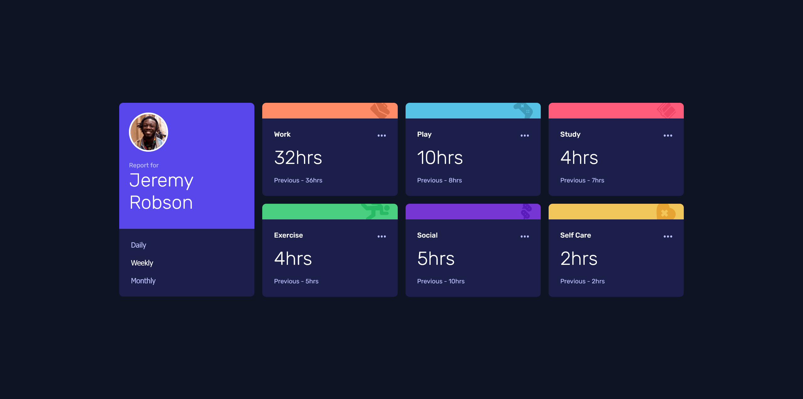

# Frontend Mentor - Time tracking dashboard solution

This is a solution to the [Time tracking dashboard challenge on Frontend Mentor](https://www.frontendmentor.io/challenges/time-tracking-dashboard-UIQ7167Jw). Frontend Mentor challenges help you improve your coding skills by building realistic projects.

## Table of contents

- [Overview](#overview)
  - [The challenge](#the-challenge)
  - [Screenshot](#screenshot)
  - [Links](#links)
- [My process](#my-process)
  - [Built with](#built-with)
  - [What I learned](#what-i-learned)
  - [Continued development](#continued-development)

## Overview

### The challenge

Users should be able to:

- View the optimal layout for the site depending on their device's screen size
- See hover states for all interactive elements on the page
- Switch between viewing Daily, Weekly, and Monthly stats

### Screenshots

### Links

- Solution URL: [solution URL here](https://your-solution-url.com)
- Live Site URL: [live site URL here](https://peterjgalvan.github.io/Time-Tracking-Dashboard-Static-Frontend-Mentor/)

## My process

### Built with

- Mobile-first workflow
- Semantic HTML5 markup
- CSS custom properties (variables)
- Flexbox
- CSS Grid
- JSON File Data
- Google Fonts
- JavaScript

### What I learned

I learned how to work with a JSON object and how to pull in that information and display in properly in the respected areas in the HTML. I also began working with CSS variables might not be prefect do to the 1st attempt. However trying to get better at only have one place to update code to make the changes the document wants vs have to go to multiple classes.

### Continued development

I want to make a another repo where I do this challenge using react so I can break it down to components and get more familiar with react in general. Also I would like to come back and refactor my code I see a way to take the Work, Play, etc tabs and display them using JS with the map function to severely lower the amount of HTML maybe by 150+ lines.
